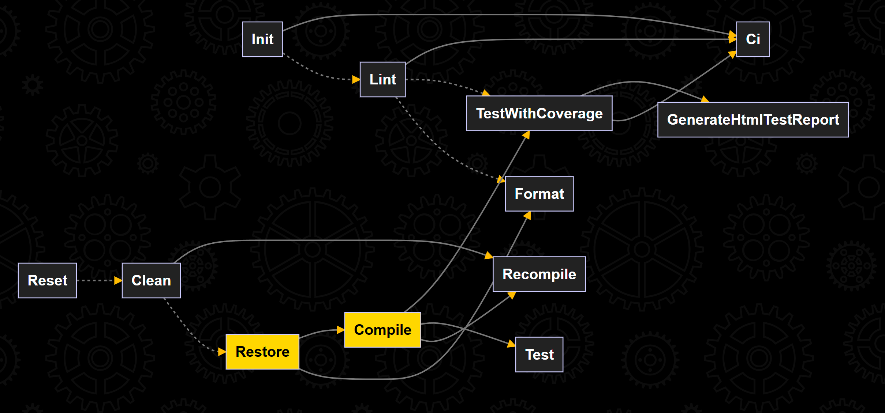
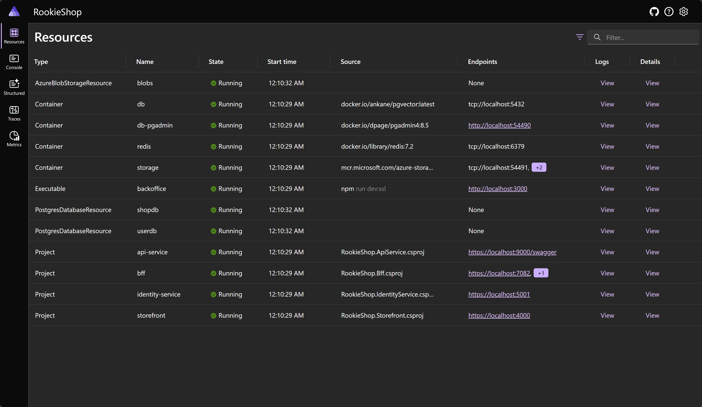
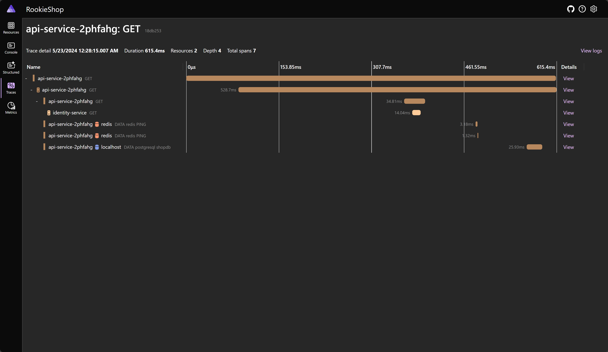

<h1>RookieShop: Rookie Phase-1 Assignment Project</h1>

[](https://github.com/foxminchan/RookieShop/issues)
[](https://github.com/foxminchan/RookieShop/actions/workflows/ci.yaml)
[](https://github.com/foxminchan/RookieShop/actions/workflows/lint.yaml)
[](https://github.com/foxminchan/RookieShop/actions/workflows/deploy-docs.yml)
[](https://sonarcloud.io/summary/new_code?id=foxminchan_RookieShop)
[](https://opensource.org/licenses/MIT)

<p align="justify">
RookieShop is a .NET Core web application training project demonstrating Clean Architecture, DDD and modern web development with Aspire and Next.js. The project is part of the Rookie Phase-1 Assignment at NashTech.
</p>

<hr/>

<h2>Table of Contents</h2>

- [Requirements](#requirements)
- [Project Progress Report](#project-progress-report)
- [Technical Stack](#technical-stack)
- [Software Architecture](#software-architecture)
- [Getting Started](#getting-started)
  - [Prerequisites](#prerequisites)
    - [Windows with Visual Studio](#windows-with-visual-studio)
    - [Mac, Linux, \& Windows without Visual Studio](#mac-linux--windows-without-visual-studio)
  - [Setup tools and dependencies](#setup-tools-and-dependencies)
  - [Setup Stripe webhook](#setup-stripe-webhook)
  - [User secrets example](#user-secrets-example)
  - [Running the application](#running-the-application)
- [Testing](#testing)
- [CI/CD](#cicd)
- [Deployment](#deployment)
- [Observability](#observability)
- [Project References](#project-references)
- [License](#license)
- [Organization](#organization)

## Requirements

Build an e-commerce web site with minimum functionality below:

**For customers:**

- `Home page: category menu, features products`
- `View products by category`
- `View product details`
- `Product rating`
- Register
- Login/Logout
- Optional (Shopping Cart, Ordering, IdentityServer4)

**For admin:**

- Login/logout
- `Manage product categories (Name, Description)`
- `Manage products (Name, Category, Description, Price, Images, CreatedDate, UpdatedDate)`
- `View customers`

> [!NOTE]
>
> <p align="justify">
> The project should apply as many techniques of ASP.NET MVC Core as possible. For example: TagHelpers, Razor Pages, ViewComponents and have Unit Test. The Unit Test do not need to have a high coverage number but should demonstrate the ability to write unit test for common components: Controllers, ViewComponents, Services …
> </p>

## Project Progress Report

- [Checkpoint (26/05/2024)](https://1drv.ms/v/c/68d538396ba820a0/Edn9AsMZb91Gucj7rzH0V14B-UQe3aOCvSJM3OJL2nw8XQ?e=IJgTaw)
- [Checkpoint (02/06/2024)](https://1drv.ms/v/c/68d538396ba820a0/Ed7qSBv_CVBGvcPsxux1Z40BsZVUyOixPEfXWY6uhakrXA?e=LNUrA5)

## Technical Stack

- [ASP.NET Core 8.0](https://docs.microsoft.com/en-us/aspnet/core/?view=aspnetcore-8.0)
- [htmx](https://htmx.org/)
- [Alphine.js](https://alpinejs.dev/)
- [///\_hyperscript](https://hyperscript.org/)
- [Next.js 14.0](https://nextjs.org/)
- [Duende IdentityServer 7.0](https://duendesoftware.com/products/identityserver)
- [Redis](https://redis.io/)
- [Postgres](https://www.postgresql.org/)
- [Aspire](https://learn.microsoft.com/dotnet/aspire)
- [Yarp](https://microsoft.github.io/reverse-proxy/)
- [OpenTelemetry](https://opentelemetry.io/)
- [NUKE](https://nuke.build/)
- [Semantic Kernel](aka.ms/semantic-kernel)
- [OpenAI](https://openai.com/)

## Software Architecture


| No  | Name            | Usecase                                                                                              | Technology                                |
| --- | --------------- | ---------------------------------------------------------------------------------------------------- | ----------------------------------------- |
| 1   | back office     | An admin-facing website that allows administrators to manage products, categories, and customers     | Next.js 14.0                              |
| 2   | identity server | An authentication server that provides authentication and authorization services for the application | Duende IdentityServer 7.0                 |
| 3   | bff             | A backend for frontend that provides data to the admin-facing website                                | Yarp                                      |
| 4   | store front     | A user-facing website that allows customers to view, rate, and purchase products                     | Razor, htmx, Alphine.js, ///\_hyperscript |
| 5   | web api         | A REST API that provides data to the user-facing and admin-facing websites                           | ASP.NET Core 8.0                          |
| 6   | cache           | A distributed lock manager, cache and cart storage                                                   | Redis                                     |
| 7   | database        | A relational database that stores the application's data and email outbox                            | Postgres, Marten                          |
| 8   | observability   | A telemetry data collector that collects and exports telemetry data to the Aspire Dashboard          | OpenTelemetry                             |
| 9   | openai          | A language model that handles the natural language processing tasks                                  | OpenAI                                    |

## Getting Started

### Prerequisites

- Get the latest source code: [https://github.com/foxminchan/RookieShop](https://github.com/foxminchan/RookieShop)
- Install & start Docker Desktop: [https://docs.docker.com/engine/install/](https://docs.docker.com/engine/install/)
- Install .NET 8.0 SDK: [https://dotnet.microsoft.com/download](https://dotnet.microsoft.com/download)
- Install Node.js: [https://nodejs.org/en/download/](https://nodejs.org/en/download/)
- Install bun: [https://bun.sh/](https://bun.sh/)
- Install Stripe CLI: [https://stripe.com/docs/stripe-cli](https://stripe.com/docs/stripe-cli)
- Open AI API Key: [https://platform.openai.com/](https://platform.openai.com/)

#### Windows with Visual Studio

- Install [Visual Studio 2022](https://visualstudio.microsoft.com/downloads/)

#### Mac, Linux, & Windows without Visual Studio

- Install the latest [.NET 8.0 SDK](https://dotnet.microsoft.com/en-us/download)
- Install [Visual Studio Code with C# Dev Kit](https://code.visualstudio.com/docs/csharp/get-started)

> [!TIP]
> Using JetBrains Rider is also a good choice for developing .NET Core applications in Mac and Linux.

### Setup tools and dependencies

```bash
# Setup the tools

npm install
dotnet tool restore

# Install the dependencies for the .NET Core projects

cd RookieShop
dotnet restore ./RookieShop.sln
```

### Setup Stripe webhook

```bash
stripe login

stripe listen --forward-to https://localhost:9000/api/stripe
```

### User secrets example

```json
{
  "Parameters": {
    "SqlUser": "",
    "SqlPassword": "",
    "StripeApiKey": "",
    "StripeWebhookSecret": "",
    "EmailSecret": "",
    "GoogleClientId": "",
    "GoogleClientSecret": "",
    "OpenAiKey": ""
  },
  "ConnectionStrings": {
    "openai": "Key="
  }
}
```

### Running the application

> [!WARNING]
> Remember to ensure that Docker is started

- (Windows only) Run the application from Visual Studio:
- Open the `RookieShop.sln` solution file in Visual Studio
- Ensure `RookieShop.AppHost` are set as the startup projects
- Hit `F5` to run the application
- Or run the application from your terminal:

```bash
dotnet run --project src/RookieShop.AppHost/RookieShop.AppHost.csproj
```

## Testing

<p align="justify">

In the project, i use xUnit for unit testing, Moq for mocking and FluentAssertions for assertion. For functional testing, i use the <code>Aspire xUnit</code> for running the test in the <code>Aspire</code> environment.

I also use the <code>NetArchTest</code> library to enforce the architecture rules in the project. The test project is located in the <code>tests</code> folder.

I follow the <b>Test Pyramid</b> strategy to write the test. To run the test, you can use the following command:

</p>

```bash
dotnet test RookieShop.sln
```

> [!NOTE]
> For performance testing, i use the <code>K6</code> tool to simulate the load on the application. To run the performance test, you can use the following:
>
> ```bash
> k6 run ./k6/performance-test.js
> ```

## CI/CD

<p align="justify">
I implement the CI/CD pipeline for the project using the <code>NUKE</code> with the <code>GitHub Actions</code>. The pipeline consists of the following steps:
</p>



## Deployment

<p align="justify">
Deploying the application to the production environment by using <a href="https://prom3theu5.github.io/aspirational-manifests" target="_blank"><code>Aspirate (Aspir8)</code></a> by running the following command:
</p>

```bash
dotnet aspirate generate
dotnet aspirate apply
```

## Observability

<p align="justify">
The project uses OpenTelemetry to collect the telemetry data from the application. The data is sent to the OpenTelemetry Collector and exported to the Aspire Dashboard. The Aspire Dashboard is a monitoring and observability tool that provides insights into the application's performance and behavior. It helps developers to identify and troubleshoot issues in the application.
</p>





## Project References

- https://github.com/dotnet/eShop
- https://github.com/aspirant-project/aspirant
- https://github.com/dotnet-architecture/eShopOnWeb
- https://github.com/ardalis/CleanArchitecture
- https://github.com/phongnguyend/Practical.CleanArchitecture

## License

This project is licensed under the MIT License - see the [LICENSE](./LICENSE) file for details.

## Organization

<a href="https://www.nashtechglobal.com/" target="_blank">
	
</a>
