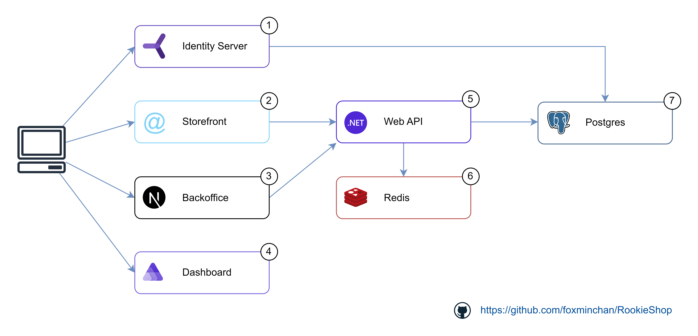
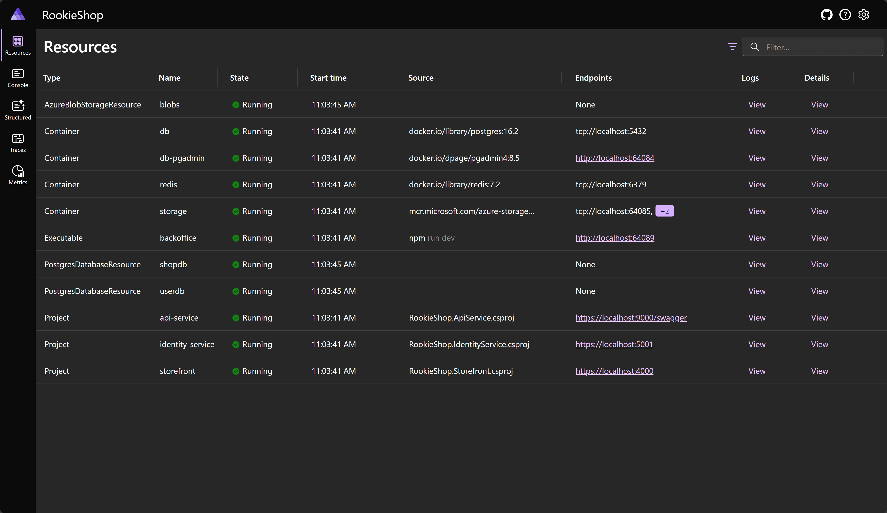
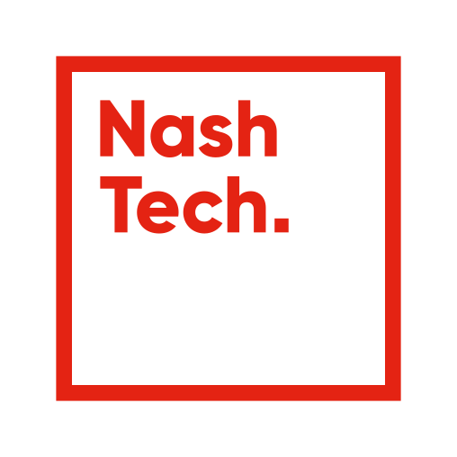

# RookieShop: .NET & Aspire Dashboard Training Project

[](https://sonarcloud.io/summary/new_code?id=foxminchan_RookieShop)
[](https://opensource.org/licenses/MIT)

<p align="justify">
RookieShop Web Application is a assignment project for training purpose. The project is a web application make the best practices of .NET Core in Clean Architecture and Domain-Driven Design and contain multiple design-patterns and principles. It demonstrates how to build a modern web application using .NET Core with Aspire Dashboard and Next.js.
</p>

<hr/>

## Technical Stack

- [ASP.NET Core 8.0](https://docs.microsoft.com/en-us/aspnet/core/?view=aspnetcore-8.0)
- [Next.js 14.0](https://nextjs.org/)
- [Duende IdentityServer 7.0](https://duendesoftware.com/products/identityserver)
- [Redis](https://redis.io/)
- [Postgres](https://www.postgresql.org/)
- [Aspire](https://learn.microsoft.com/dotnet/aspire)
- [OpenTelemetry](https://opentelemetry.io/)

## Software Architecture



## Getting Started

### Prerequisites

- Get the latest source code: [https://github.com/foxminchan/RookieShop](https://github.com/foxminchan/RookieShop)
- Install & start Docker Desktop: [https://docs.docker.com/engine/install/](https://docs.docker.com/engine/install/)

#### Windows with Visual Studio

- Install [Visual Studio 2022](https://visualstudio.microsoft.com/downloads/)

#### Mac, Linux, & Windows without Visual Studio

- Install the latest [.NET 8.0 SDK](https://dotnet.microsoft.com/en-us/download)
- Install [Visual Studio Code with C# Dev Kit](https://code.visualstudio.com/docs/csharp/get-started)

> Or use JetBrains Rider for the best experience

### Setup tools and dependencies

```bash
# Setup the tools

bun install
dotnet tool restore

# Install the dependencies for the backend

cd RookieShop
dotnet restore ./RookieShop.sln

# Install the dependencies for the frontend

cd ui/storefront
pnpm install
cd ../backoffice
bun install
```

### Start the infrastructure

```bash
docker-compose --env-file .env up -d
```

> [!IMPORTANT]
> Create a `.env` file in the root directory and set the environment variables.

**You can access the following services:**

1. `https://localhost:7080` for identity server
2. `https://localhost:7070` for all the REST API document
3. `https://localhost:7060` for user facing website
4. `https://localhost:7050` for admin facing website
5. `https://localhost:1888` for observability dashboard

### Running the application

> [!WARNING]
> Remember to ensure that Docker is started

1. Run the backend

- (Windows only) Run the application from Visual Studio:
- Open the `RookieShop.sln` solution file in Visual Studio
- Ensure `RookieShop.ApiService` and `RookieShop.IdentityService` are set as the startup projects
- Hit `F5` to run the application
- Or run the application from your terminal:

```bash
dotnet run --project src/RookieShop.ApiService/RookieShop.ApiService.csproj
dotnet run --project src/RookieShop.IdentityService/RookieShop.IdentityService.csproj
```

2. Run the frontend for the user-facing website

```bash
cd ui/storefront && bun dev
```

3. Run the frontend for the admin-facing website

```bash
cd ui/backoffice && pnpm run dev
```

## Observability

<p align="justify">
The project uses OpenTelemetry to collect the telemetry data from the application. The data is sent to the OpenTelemetry Collector and exported to the Aspire Dashboard. The Aspire Dashboard is a monitoring and observability tool that provides insights into the application's performance and behavior. It helps developers to identify and troubleshoot issues in the application.
</p>



## Project References

- https://github.com/dotnet/eShop
- https://github.com/ardalis/CleanArchitecture
- https://github.com/thangchung/clean-architecture-dotnet
- https://github.com/phongnguyend/Practical.CleanArchitecture

## License

This project is licensed under the MIT License - see the [LICENSE](./LICENSE) file for details.

## Organization

<a href="https://www.nashtechglobal.com/" target="_blank">
	
</a>
